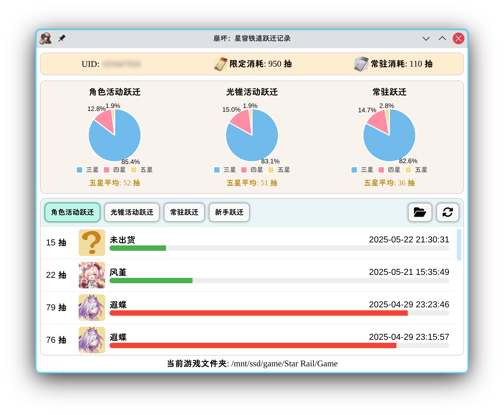

# HSRWarp

## 简介

本项目是 Linux 平台下查询《崩坏：星穹铁道》跃迁记录的工具。

本项目基于 Electron,参考 [star-rail-warp-export](https://github.com/biuuu/genshin-wish-export) 项目开发。

目前仅支持国服和简体中文。

## 使用说明

1. 点击文件夹选择按钮，选择存在 `StarRail_Data` 文件夹的游戏目录，假设 `/home/yourname/Star Rail/Game` 存在该文件夹，那你就需要选择 `/home/yourname/Star Rail/Game` 目录。
2. 打开游戏跃迁详情，让游戏把跃迁记录缓存到本地。
3. 点击同步按钮，等待同步完成。

## 配置说明

本项目配置文件保存在 `~/.config/hsr_warp/` 文件夹下，包含以下文件：

- `userData/config.json`：配置文件。
- `userData/gacha-list-{your_uid}.json` 跃迁记录文件。
- `imageCache.db` 图片缓存数据库。
- `image_cache/` 图片缓存文件夹。

## 截图

> 由于跃迁记录存在时效性，因此最早的五星跃迁记录所显示的抽数可能与实际不符，从而导致平均抽数计算值偏低。

