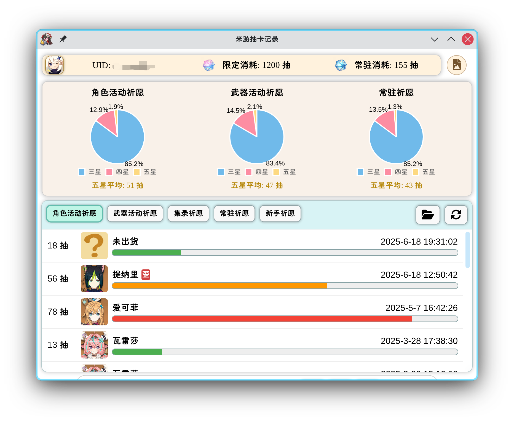
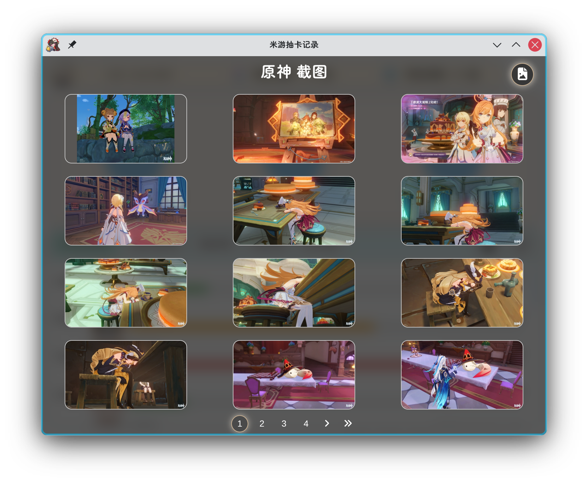
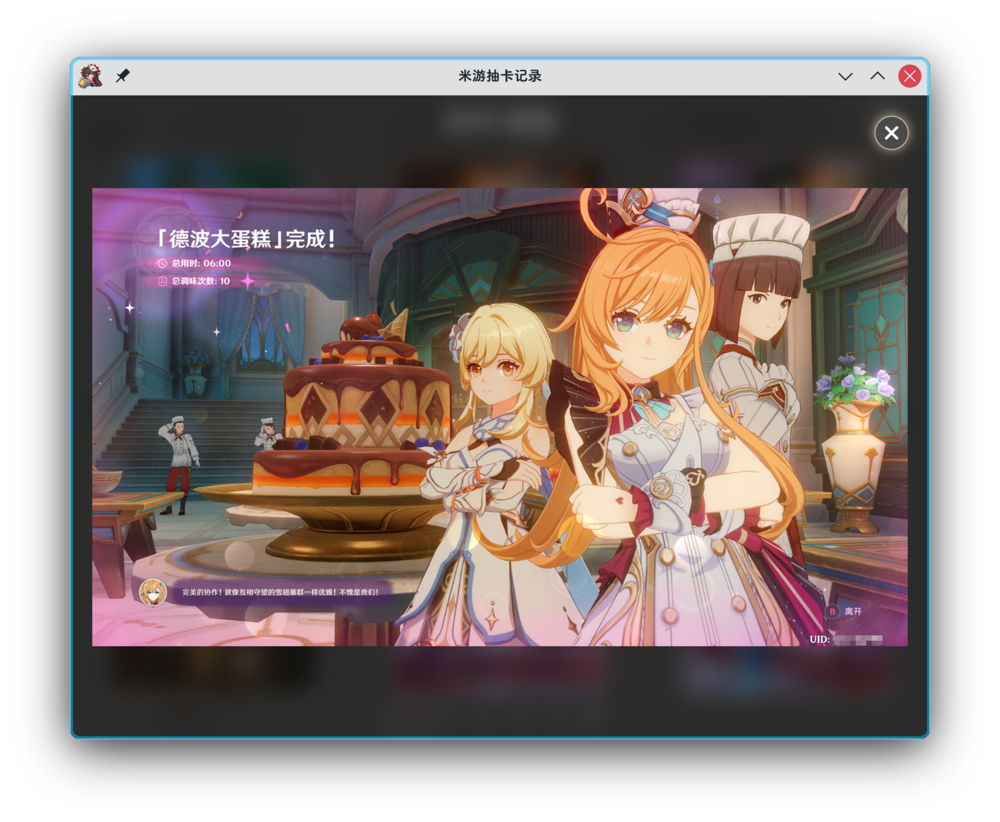
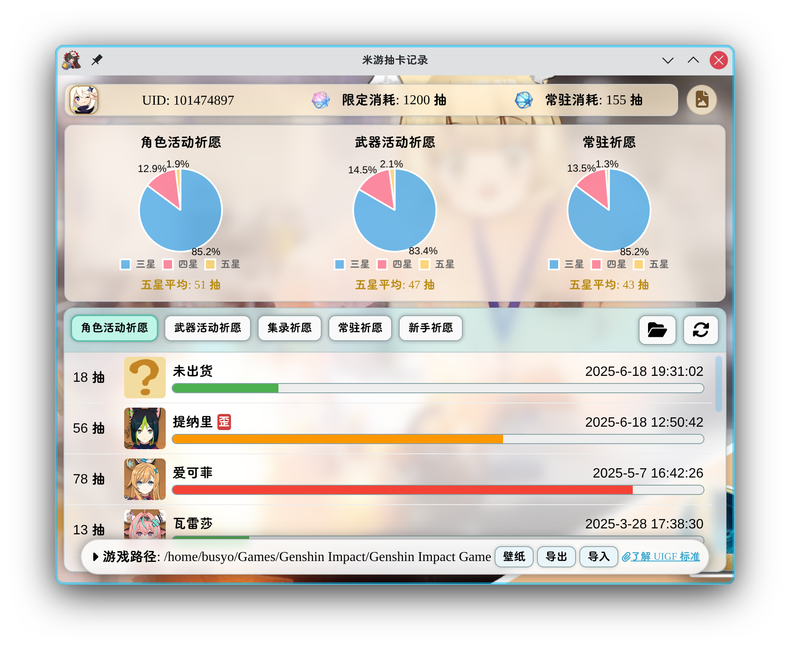
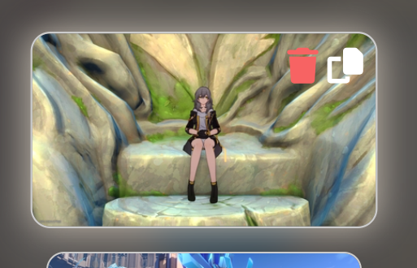

# MHYWarp

## 简介

本项目是 Linux 平台下查询《崩坏：星穹铁道》跃迁记录的工具。

本项目基于 Electron,参考 [star-rail-warp-export](https://github.com/biuuu/genshin-wish-export) 项目开发。

目前仅支持国服和简体中文。

## 安装说明

### 下载 release 版本

下载最新发布的版本，双击 AppImage 运行即可。

### AUR 包管理器安装

Arch Linux 用户可以使用 AUR 包管理器安装。

```
yay -S mhy-warp-bin
```

## 使用说明

### 抽卡记录

1. 点击文件夹选择按钮，选择存在 `StarRail_Data` 文件夹的游戏目录，假设 `/home/yourname/Star Rail/Game` 存在该文件夹，那你就需要选择 `/home/yourname/Star Rail/Game` 目录。
2. 打开游戏跃迁详情，让游戏把跃迁记录缓存到本地。
3. 点击同步按钮，等待同步完成。
4. 点击游戏图标选择查询的游戏 。

### 截图浏览

1. 点击右上角截图按钮，进入截图浏览界面。
2. 点击任意截图查看大图。
3. 在大图界面鼠标滚轮控制图片缩放，左键拖拽控制图片移动。
4. 在大图界面右键可以复制图片（复制的是源文件）。
5. 在截图浏览界面任意缩略图右上角有两个按钮，一个删除截图按钮，一个复制截图按钮。删除的截图可以在回收站中恢复，复制的截图可以在粘贴板中使用。

### 导入导出

1. 鼠标移动到下方弹出工具栏。
2. 点击导入、导出按钮，进行 UIGF 文件导入导出。

### 背景界面

1. 鼠标移动到下方弹出工具栏。
2. 左键点击壁纸按钮，选择壁纸并应用。
3. 右键点击壁纸按钮，清除壁纸。
4. 在壁纸按钮上滚动鼠标滚轮可以控制模糊效果的强度。

## 配置说明

本项目配置文件保存在 `~/.config/mhy_warp/` 文件夹下，包含以下文件：

- `userData/config.json`：配置文件。
- `userData/{game}-gacha-list-{your_uid}.json` 跃迁记录文件。
- `image_cache_{game}/` 图片缓存文件夹。
- `bgCache` 壁纸缓存文件。
- `thumbnails` 缩略图缓存文件夹。

## 截图

> 由于跃迁记录存在时效性，因此最早的五星跃迁记录所显示的抽数可能与实际不符，从而导致平均抽数计算值偏低。









